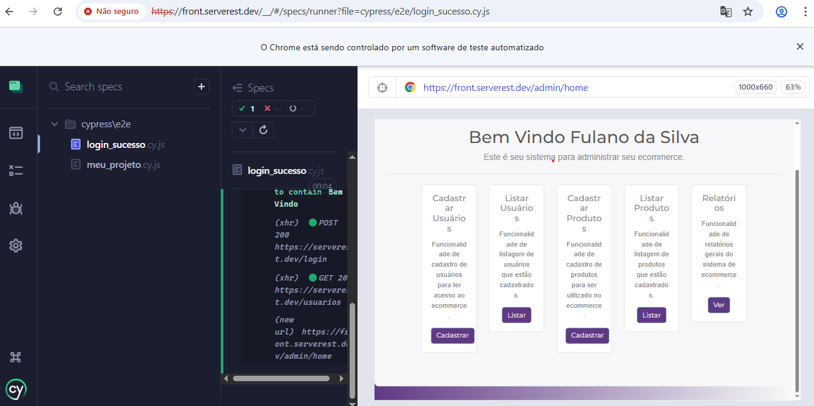
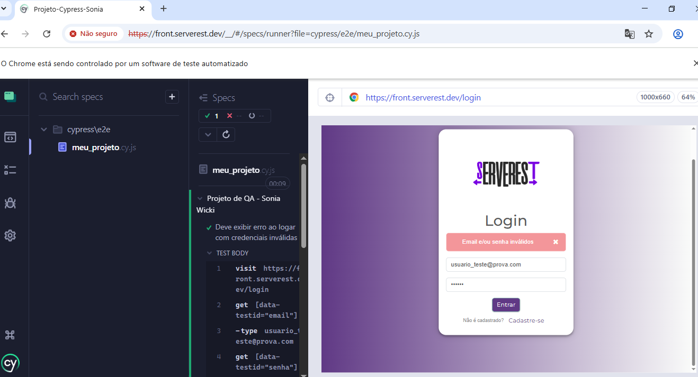

# 🚀 Automação de Testes E2E - ServeRest

Este projeto faz parte do meu portfólio de **Analista de Qualidade (QA)**, focado na automação de fluxos críticos utilizando **Cypress** e **JavaScript**.

## 🎯 Objetivo
Validar as funcionalidades de login e navegação do ambiente **ServeRest**, garantindo que o sistema se comporte corretamente tanto em fluxos de sucesso quanto em cenários de erro.

## 🛠️ Tecnologias e Ferramentas
* **Framework:** Cypress
* **Linguagem:** JavaScript
* **IDE:** VS Code
* **Ambiente de Teste:** [ServeRest Front](https://front.serverest.dev/login)

## 🧪 Cenários de Teste
- [x] **Login com Sucesso:** Valida a entrada no sistema com credenciais corretas.
- [x] **Login Negativo:** Verifica o alerta de erro ao inserir e-mail ou senha inválidos.
- [ ] **Cadastro de Usuário:** (Próximo passo do roadmap).

## 🚀 Como Executar o Projeto
1. Clone este repositório para sua máquina.
2. No terminal do VS Code, instale as dependências necessárias:
   ```bash
   npm install
   ```
3. Para abrir o painel do Cypress e rodar os testes:
   ```bash
   npx cypress open
   ```

## Evidencias de testes 

