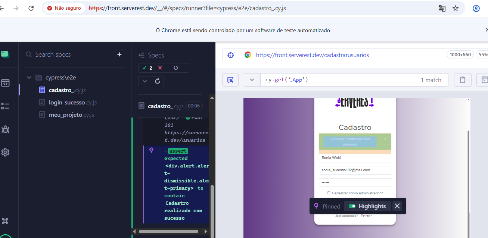
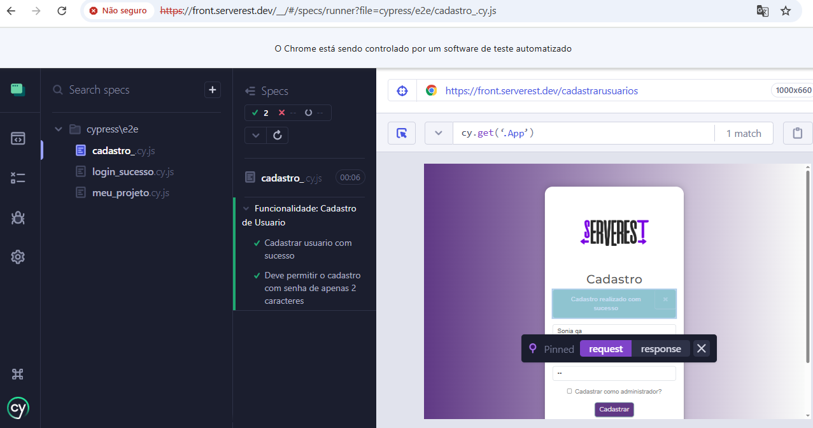

# 🚀 Automação de Testes E2E - ServeRest

Este projeto faz parte do meu portfólio de **Analista de Qualidade (QA)**, focado na automação de fluxos críticos utilizando **Cypress** e **JavaScript**.

## 🎯 Objetivo
Validar as funcionalidades de login, cadastro e navegação do ambiente **ServeRest**, garantindo que o sistema se comporte corretamente tanto em fluxos de sucesso quanto em cenários de erro.

## 🛠️ Tecnologias e Ferramentas
* **Framework:** Cypress
* **Linguagem:** JavaScript
* **IDE:** VS Code
* **Ambiente de Teste:** [ServeRest Front](https://front.serverest.dev/login)

## 🧪 Cenários de Teste Automatizados
- [x] **Login com Sucesso:** Valida a entrada no sistema com credenciais corretas.
- [x] **Login Negativo:** Verifica o alerta de erro ao inserir e-mail ou senha inválidos.
- [x] **Cadastro de Usuário:** Validação de criação de conta com dados válidos.
- [x] **Cadastro (Senha Curta):** Teste de comportamento do sistema com senha de apenas 2 caracteres.

## 🚀 Como Executar o Projeto
1. Clone este repositório para sua máquina.
2. No terminal do VS Code, instale as dependências necessárias:
   ```bash
   npm install
   ```
3. Para abrir o painel do Cypress e rodar os testes:
   ```bash
   npx cypress open
   ```

## Evidencias de testes 
### 🔐 Login
* **Sucesso:**

* **Erro (Dados Inválidos):**


### 👤 Cadastro de Usuário
* **Cadastro com Sucesso:**

* **Cenário: Cadastro com senha de 2 caracteres (Permissivo):**

* **Logs de Execução (Suíte de Cadastro):**


🔍 Análise Crítica e Sugestões de Melhoria (Mindset QA)

Durante o desenvolvimento dos testes de Cadastro, identifiquei pontos importantes para a segurança e qualidade do produto:

Validação de Senha: O sistema permite o cadastro com senhas de apenas 2 caracteres.

Sugestão: Implementar um limite mínimo de caracteres (ex: 6 ou 8) para garantir a segurança das contas dos usuários.

Massa de Dados: Foi utilizada a lógica de geração de e-mails aleatórios com Math.random() para garantir que cada execução de teste de cadastro seja única e independente, evitando falhas por "usuário já existente".
