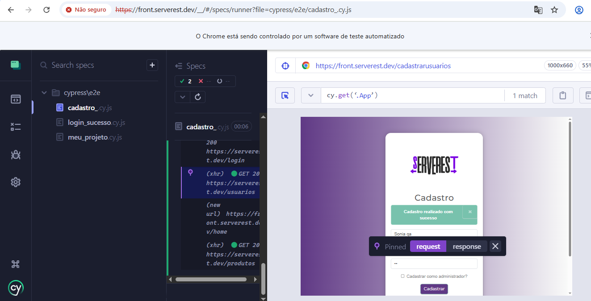

# 🚀 Automação de Testes E2E - ServeRest

Este projeto faz parte do meu portfólio de **Analista de Qualidade (QA)**, focado na automação de fluxos críticos utilizando **Cypress** e **JavaScript**.

## 🎯 Objetivo
Validar as funcionalidades de login, cadastro e navegação do ambiente **ServeRest**, garantindo que o sistema se comporte corretamente tanto em fluxos de sucesso quanto em cenários de erro.

## 🛠️ Tecnologias e Ferramentas
* **Framework:** [Cypress](https://www.cypress.io/)
* **Linguagem:** JavaScript
* **IDE:** VS Code
* **Ambiente de Teste:** [ServeRest Front](https://front.serverest.dev/login)

## 🧪 Roadmap de Testes (Cobertura)
* 🔐 **Login:** Sucesso, validação de credenciais inválidas e tratamento de campos vazios.
* 👤 **Cadastro de Usuário:** Criação de conta com dados válidos e login automatizado pós-cadastro.
* ⚠️ **Cadastro (Análise Crítica):** Teste de comportamento com senha curta.
* 📦 **Produtos:** Listagem e busca *(Em breve 🚀)*
* 🛒 **Carrinho:** Fluxo de compra *(Em breve 🚀)*

## 💪 Diferenciais Técnicos Aplicados (Refatoração)
Durante o desenvolvimento da automação, o projeto foi evoluído para aplicar conceitos avançados de arquitetura de testes:
* **Massa de Dados Dinâmica (`Math.random()`):** Utilização de lógica de e-mails aleatórios únicos a cada execução para garantir a independência dos testes, evitando falsos negativos por "usuário já existente" ou falhas devido a resets e limpezas no banco de dados do servidor (Erro 401).
* **Resiliência e Tratamento de Seletores:** Mapeamento e correção individualizada de seletores de elementos do front-end que divergem entre as telas do sistema (como as propriedades de campos de senha e alertas).

## 📂 Estrutura do Projeto
* `cypress/e2e/`: Scripts de teste agrupados por funcionalidade (`login.cy.js`, `cadastro.cy.js`).
* Raiz do projeto: Contém as evidências de execução e documentação.

## 🚀 Como Executar o Projeto
1. Clone este repositório para sua máquina.
2. No terminal do VS Code, instale as dependências:
   ```bash
   npm install

   ```
3. Para abrir o painel do Cypress e rodar os testes:
   ```bash
   npx cypress open
   ```

## 📸 Evidências de Testes 

### 🔐 Login
* **Cenários de Sucesso e Erro:**


### 👤 Cadastro de Usuário
* **Fluxo Completo e Logs:**


* **Cenário Crítico (Senha de 2 caracteres):**


🔍 Mindset de QA: Análise Crítica e Melhorias

Melhoria de Segurança Identificada: Durante a automação, identifiquei que o sistema permite cadastrar usuários com senhas de apenas 2 caracteres.

Sugestão de Negócio: Implementar uma validação de minLength (mínimo de 8 caracteres contendo letras e números) no front-end e no back-end para aumentar a segurança da aplicação.
