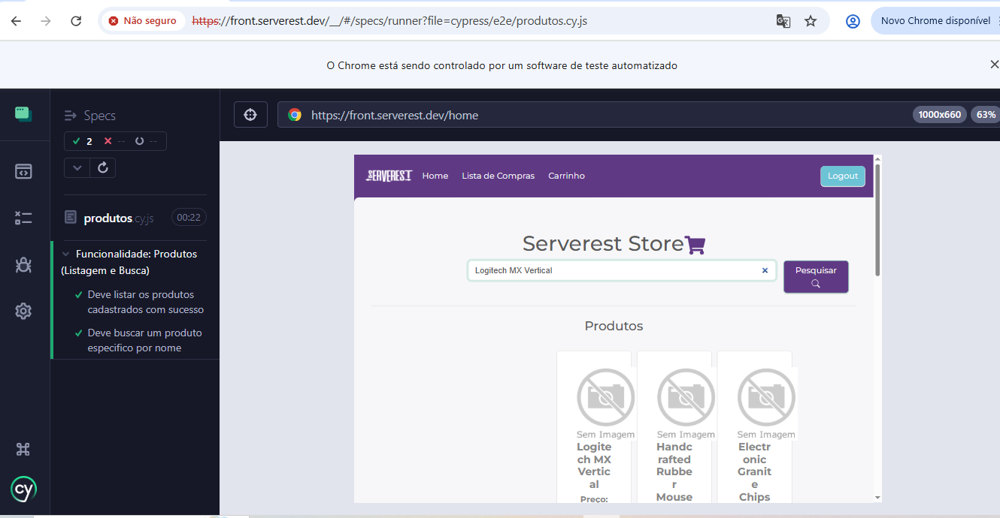
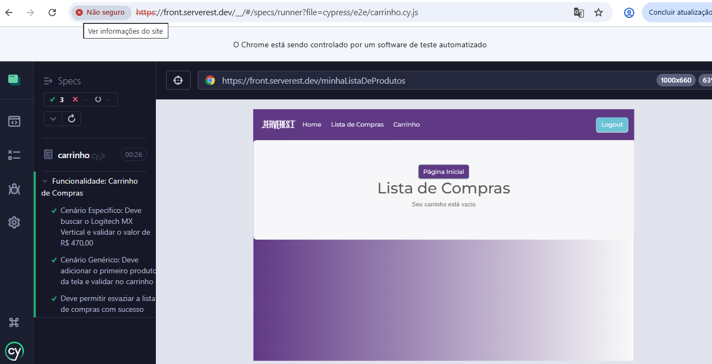
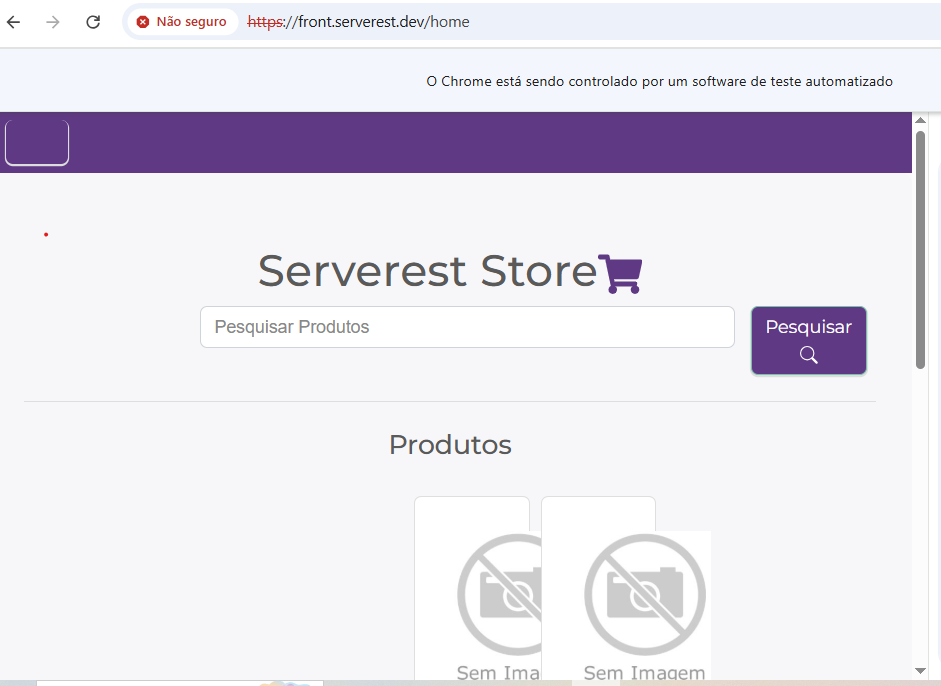

Este projeto faz parte do meu portfólio de **Analista de Qualidade (QA)**, focado na automação de fluxos críticos utilizando **Cypress** e **JavaScript**.

## 🎯 Objetivo
Validar as funcionalidades de login, cadastro, navegação, listagem, busca e carrinho de compras do ambiente **ServeRest**, garantindo que o sistema se comporte corretamente tanto em fluxos de sucesso quanto em cenários de erro.

## 🛠️ Tecnologias e Ferramentas
* **Framework:** [Cypress](https://www.cypress.io/)
* **Linguagem:** JavaScript
* **IDE:** VS Code
* **Ambiente de Teste:** [ServeRest Front](https://front.serverest.dev/login)

## 🧪 Roadmap de Testes (Cobertura)
* 🔐 **Login:** Sucesso, validação de credenciais inválidas e tratamento de campos vazios. *(Concluído 🟢)*
* 👤 **Cadastro de Usuário:** Criação de conta com dados válidos e login automatizado pós-cadastro. *(Concluído 🟢)*
* 📦 **Produtos:** Listagem de produtos cadastrados e busca específica por nome utilizando massa de dados real. *(Concluído 🟢)*
* 🛒 **Carrinho de Compras:** Busca de produto, adição à lista por escopo, validação de valores de integridade e limpeza de carrinho. *(Concluído 🟢)*

## 💪 Diferenciais Técnicos Aplicados (Refatoração & Resiliência)
Durante o desenvolvimento da automação, o projeto foi evoluído para aplicar conceitos avançados de arquitetura de testes:
* **Massa de Dados Dinâmica (`Math.random()`):** Utilização de lógica de e-mails aleatórios únicos a cada execução para garantir a independência dos testes, evitando falsos negativos por "usuário já existente" ou falhas devido a resets e limpezas no banco de dados do servidor (Erro 401).
* **Tratamento de Exceções Globais (`Uncaught Exception`):** Implementação de blindagem no Cypress para ignorar falhas de código interno do próprio site (`TypeError`), garantindo a continuidade e estabilidade da suíte de testes de regressão mesmo em ambientes instáveis.
* **Resiliência e Ajuste de Timeouts:** Ajuste estratégico do tempo de espera do robô (`timeout: 10000`) para mitigar problemas de sincronismo e lentidão nas requisições do servidor.
* **Estratégias de Busca Híbridas (Específica vs. Genérica):** No fluxo do carrinho, foi implementado tanto um teste baseado em massa de dados específica (buscando um produto alvo e validando seu preço exato na tela) quanto um teste orientado a dados dinâmicos (capturando o primeiro produto disponível na tela por indexação, garantindo a resiliência do teste caso o banco de dados mude).

## 📂 Estrutura do Projeto
* `cypress/e2e/`: Scripts de teste agrupados por funcionalidade (`login.cy.js`, `cadastro.cy.js`, `produtos.cy.js`, `carrinho.cy.js`).
* Raiz do projeto: Contém as evidências de execução e documentação.

## 🐛 Desafios e Bugs Encontrados (Relatório de QA)
Durante os testes da aplicação, foram identificadas falhas críticas na plataforma testada:
* **O Bug do Servidor (Tela de Cadastro):** Ao clicar no botão de cadastro, a aplicação ocasionalmente sofria uma quebra interna retornando o erro `TypeError: Cannot read properties of undefined (reading 'data')`. Esse bug quebrava o layout da página, sobrepondo imagens e travando a navegação automática para a `/home`.
    * **Ação de QA:** O robô foi configurado para ignorar o colapso visual, aguardar o tempo de resposta e focar nos elementos de busca, completando os testes com sucesso (**Passed**).
* **Bug de Persistência de Dados (Carrinho de Compras):** O carrinho não possui persistência de estado ou sessão. Ao adicionar um produto à lista e navegar para outra página (como voltar para a `/home`), os itens previamente adicionados são limpos da memória. Ao retornar para a rota `/minhaListaDeProdutos`, o carrinho é exibido como vazio.
    * **Ação de QA:** O cenário de teste de persistência por clique/navegação foi mapeado e validado manualmente para confirmação do bug, porém removido da suíte automatizada de regressão final para evitar falsos negativos (*flaky tests*) gerados por essa limitação da própria aplicação.

## 🔍 Análise Crítica e Sugestões de Melhoria
Durante a criação dos roteiros de automação e análise exploratória, identifiquei uma vulnerabilidade que impacta diretamente a segurança e a integridade dos dados dos usuários da aplicação:
* **Melhoria de Segurança Identificada:** O sistema atualmente permite o cadastro de contas com senhas extremamente curtas (com apenas 2 caracteres), sem qualquer validação de complexidade.
* **Sugestão de Negócio:** 
    * **Front-end:** Implementar uma validação visual no formulário de cadastro impedindo o envio caso a senha não atinja os requisitos mínimos, disparando um alerta em tempo real para o usuário.
    * **Back-end:** Adicionar uma regra de validação rigorosa de `minLength` (mínimo de 8 caracteres contendo letras e números) para aumentar a segurança da aplicação e prevenir ataques de força bruta.

## 🚀 Como Executar o Projeto
1. Clone este repositório para sua máquina.
2. No terminal do VS Code, instale as dependências:
   ```bash
   npm install

   ```
3. Para abrir o painel do Cypress e rodar os testes:
   ```bash
   npx cypress open
   ```

## 📸 Evidências de Testes 

### 🔐 Login
* **Cenários de Sucesso e Erro:**


### 👤 Cadastro de Usuário
* **Fluxo Completo e Logs:**


* **Cenário Crítico (Senha de 2 caracteres):**


### 📦 Produtos (Listagem e Busca)
* **Logs de Execução com Sucesso:**


### 🛒 Carrinho de Compras
* **Fluxo de Sucesso, Busca Avançada e Limpeza:**


### ⚠️ Instabilidade de Infraestrutura (Evidência do Bug)
* **Quebra do Servidor pós-cadastro (Erro de Código e Layout Desconfigurado):**
